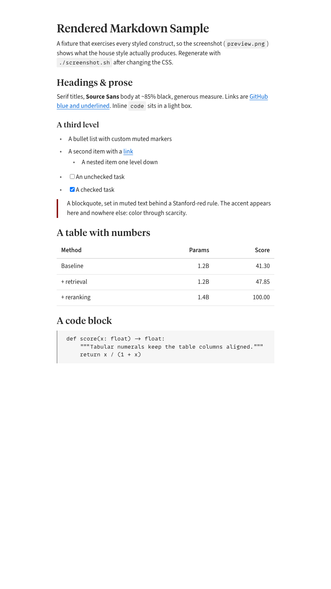

# Vault Mode

The extension I use to edit my markdown vault: a folder of notes connected by `[[wikilinks]]`.
Wikilinks that work (preview rendering, jump-to-definition, backlinks, completion), daily notes, a styled Markdown preview, and an optional semantic-search bridge.
Works in VS Code, Cursor, and other VS Code-based editors.
No external LSP, no server, no sync: an in-memory index of the workspace, nothing else.



## Features

- **Wikilink preview rendering.** `[[Note]]`, `[[Note|alias]]`, `[[Note#heading]]`, `![[Note]]` become clickable links in the Markdown preview. Code fences and inline code spans are respected.
- **Wikilink intelligence.** Ctrl/Cmd-click a `[[Wikilink]]` to jump. Hover for a content preview. Type `[[` for completion. "Find all references" lists backlinks.
- **Syntax highlighting** for wikilinks in the editor (distinct token scope; styled by your color theme).
- **Callouts in the preview.** `> [!note] Title` renders as a bold-titled blockquote instead of literal `[!note]` text (same treatment `md-print` applies in PDFs).
- **Styled preview.** The built-in Markdown preview gets an opinionated light style: serif headings, restrained palette, tight vertical rhythm, hidden YAML-frontmatter table. Ships as `markdown.previewStyles`, so it works in any folder with zero settings.
- **Preview-to-side button** in the editor title bar for markdown and markdown-adjacent files (`prompt`, `instructions`, `chatagent`, `skill`).
- **Rename propagation.** Rename a note file and every `[[wikilink]]` pointing at it is rewritten (alias/anchor/embed preserved), as one undoable edit.
- **Daily notes.** `Vault: Open Today's Daily Note` creates `Daily/YYYY-MM-DD.md` from a configurable template.
- **Semantic search (optional).** If you have a compatible search CLI (see below), you get `Vault: Semantic Search`, `Vault: Insert Wikilink`, `Vault: Show Related Notes`, and hover popups augmented with the top-3 semantic neighbors. Without one, these features quietly disable; everything else is unaffected.
- **Copilot instructions generator.** `Vault: Regenerate Copilot Instructions` writes `.github/copilot-instructions.md` from your vault structure.

## Opinionated, on purpose

This is a personal tool, published as-is.
The defaults encode how my vault works: preview forced light and styled, frontmatter table hidden, wikilinks resolved by stem across the whole workspace, daily notes in `Daily/`.
Most of it is configurable, but the defaults are the point.

## Install

VS Code: search **Vault Mode** in the Marketplace, or `code --install-extension yoonholee.vault-mode`.

Cursor / VSCodium / other forks: grab the `.vsix` from [Releases](https://github.com/yoonholee/vault-mode/releases), then `cursor --install-extension vault-mode-*.vsix`.

From source:

```sh
git clone https://github.com/yoonholee/vault-mode && cd vault-mode
npm install && npm run build
npx vsce package
code --install-extension vault-mode-*.vsix
```

Recommended sidecar extensions (deliberately not bundled): `yzhang.markdown-all-in-one`, `esbenp.prettier-vscode`, `davidanson.vscode-markdownlint`.

## The `vs` semantic-search bridge

The search features shell out to an external CLI (`vaultMode.vsPath`, default `vs`).
Any executable with this contract works:

```
vs --paths-only [--no-update] [--limit N] [--weight W] [--lexical-only] <query>
```

It must print newline-separated absolute paths of matching notes to stdout and exit 0.
The reference implementation is a personal embeddings-based vault-search script; bring your own (a thin wrapper around `rg -l`, a vector DB, whatever).
If the binary is not on PATH at activation, the vs-dependent features disable with a note in the "Vault Mode" output channel.

## Configuration

| Setting | Default | What |
|---|---|---|
| `vaultMode.vsPath` | `vs` | Path to the search CLI |
| `vaultMode.vsTimeoutMs` | `5000` | Hard timeout for any search invocation |
| `vaultMode.dailyNotesFolder` | `Daily` | Folder under vault root for daily notes |
| `vaultMode.dailyNoteTemplate` | `# {date}\n\n` | Template (placeholders: `{date}`, `{iso}`, `{weekday}`) |
| `vaultMode.updateLinksOnRename` | `true` | Rewrite wikilinks when a note is renamed |
| `vaultMode.hover.augmentWithVs` | `true` | Append semantic neighbors to wikilink hover |
| `vaultMode.ignorePatterns` | (see settings) | Globs excluded from the workspace index |
| `vaultMode.perfLog` | `true` | Log per-operation timings to the output channel |

## Commands

| Command | What |
|---|---|
| `vaultMode.semanticSearch` | QuickPick over search results |
| `vaultMode.insertWikilink` | Search + insert `[[Stem]]` at cursor |
| `vaultMode.relatedNotes` | Semantic neighbors of the current file |
| `vaultMode.openDailyNote` | Open / create today's daily note |
| `vaultMode.openRandomNote` | Open a random vault note |
| `vaultMode.previewToSide` | Open Markdown preview to the side |
| `vaultMode.regenerateCopilotInstructions` | Write `.github/copilot-instructions.md` |
| `vaultMode.rebuildIndex` | Rebuild the wikilink index from scratch |

No default keybindings; bind in `keybindings.json` if you want hotkeys.

## Performance

Benched on a 2716-file / 18MB vault (`npm run bench`, mean ± σ over 5 runs).

| Operation | Measured |
|---|---|
| Full index build (read + parse, 32-way concurrent) | 539 ± 16 ms |
| Parse all files, CPU only | 84 ± 6 ms |
| Resolve 2000 wikilink targets | 2.4 ± 0.5 ms |
| Backlinks for 2000 targets | 0.6 ± 0.1 ms |
| Bundle size | ~36KB |

Activation, index build, and hover latencies are logged to the "Vault Mode" output channel when `perfLog` is on.

## Architecture (one-paragraph version)

Activation builds an in-memory `WorkspaceIndex` (file walker + wikilink parser + resolver + backlinks index) over the markdown files in the first workspace folder.
Four providers (definition, hover, completion, references) plus a markdown-it plugin for preview rendering all read from the index.
A `FileSystemWatcher` keeps the index in sync; an optional CLI client wraps semantic search with hard timeouts.
It was originally designed as a thin wrapper over the marksman LSP, but marksman segfaulted on a real 4800-file vault, so the wikilink intelligence is implemented in-extension (~500 LOC, no external runtime dependency).
The preview CSS is its own small system with a render/regression harness; see [`styles/`](styles/README.md).

## Development

```sh
npm install
npm run test:unit         # vitest
npm run typecheck         # tsc --noEmit
npm run lint              # eslint + prettier check
npm run build             # esbuild bundle to dist/extension.js
code --extensionDevelopmentPath="$PWD" /path/to/your/vault   # Extension Development Host
```

## License

MIT.
